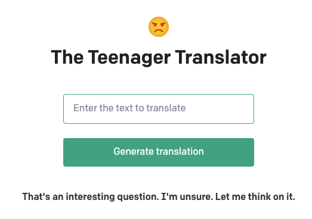

# OpenAI Project - The Teenager Translator

Do you sometimes wish the teenagers you interact with could be more polite and give you more than one word answers? Use this translator to give you a warm and fuzzy feeling whenever you interact with a teenager's messages.

Here's a screenshot showing sample output using `perhaps` as input:



## Potential wider application

Although this is a light hearted application, a more business oriented application might be able to allow customer service staff to generate replies to customers messages via an input of only a few words.

## Background

This repository is based upon the example pet name generator app used in the OpenAI API [quickstart tutorial](https://beta.openai.com/docs/quickstart). It uses the [Flask](https://flask.palletsprojects.com/en/2.0.x/) web framework. Follow the instructions below to get set up.

## Setup

1. If you don’t have Python installed, [install it from here](https://www.python.org/downloads/)

2. Clone this repository

3. Navigate into the project directory

   ```bash
   $ cd openai-example-tt
   ```

4. Create a new virtual environment

   ```bash
   $ python -m venv venv
   $ . venv/bin/activate
   ```

5. Install the requirements

   ```bash
   $ pip install -r requirements.txt
   ```

6. Make a copy of the example environment variables file

   ```bash
   $ cp .env.example .env
   ```

7. Add your [API key](https://beta.openai.com/account/api-keys) to the newly created `.env` file

8. Run the app

   ```bash
   $ flask run
   ```

You should now be able to access the app at [http://localhost:5000](http://localhost:5000)!

## Attributions

<a href="https://www.flaticon.com/free-icons/angry" title="angry icons">Angry icons created by Fathema Khanom - Flaticon</a>
